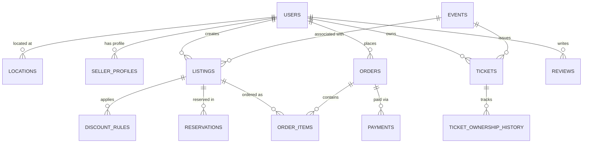

# 🌟 LastCall

> **A Comprehensive Database Management System (DBMS) Project**
> *Dynamic Surplus Food Rescue & Verified Ticket Marketplace*

[](https://web-production-e47b9.up.railway.app)


---

## 📖 Project Overview

**LastCall** is a robust web application built to demonstrate advanced database concepts, relational modeling, and secure transaction handling. The platform solves two real-world problems:

1. **Perishable Food Waste:** Allowing businesses to sell surplus food with dynamic, time-decay pricing.
2. **Event Ticket Fraud:** Preventing double-selling through strict chain-of-custody tracking.

Designed for a **DBMS Lab**, this project heavily emphasizes database normalization, integrity constraints, atomic operations, and real-time analytical views.

---

## 🗄️ Database Architecture (Core DBMS Features)

The foundation of LastCall is its highly normalized MySQL database, adhering to **3rd Normal Form (3NF)**.

### 📊 Relational Schema

The database consists of **18 InnoDB tables** with strict referential integrity (`FOREIGN KEY` constraints and `CASCADE` rules).



### ⚙️ Advanced SQL Implementation

- **Atomic Transactions & Locks:** Implemented 5-minute concurrency-safe reservation holds using `BEGIN`, `COMMIT`, and `ROLLBACK` to prevent race conditions during checkout.
- **Analytical Views:**
  - `view_seller_analytics`: Computes real-time KPIs (Total Sales, Revenue, Average Star Rating) using `GROUP BY`, `COALESCE`, and `JOIN`s, bypassing the need for application-level data aggregation.
  - `view_listing_reviews`: Aggregates reviews with buyer details and verified order items.
- **Data Integrity:** Strict input sanitization and zero string-concatenation in SQL. 100% of queries use **Prepared Statements (PDO)** to prevent SQL Injection.

---

## 🛠 Technology Stack

| Layer | Technology | Purpose |
| :--- | :--- | :--- |
| **Database** | MySQL / MariaDB 10.4+ | Primary relational data store, constraint enforcement, and views. |
| **Backend** | Vanilla PHP 8.2+ | Server-side logic, routing, and PDO database abstraction. |
| **Frontend** | HTML5, CSS3, JS (ES6+) | UI/UX, glassmorphism design, real-time discount tickers. |
| **Payments** | SSLCOMMERZ API | Sandbox payment gateway integration. |
| **Server** | Apache (XAMPP) | Local development environment. |

---

## 🚀 Installation & Setup Guide

### 1. Prerequisites

- **XAMPP** installed (Apache + MySQL running).
- PHP version 8.2 or higher.

### 2. Import Database

1. Open **phpMyAdmin** (`http://localhost/phpmyadmin/`).
2. Create a new database named `lastcall`.
3. Import the core schema:

   ```bash
   mysql -u root lastcall < database/schema.sql
   ```

4. Import the analytical views:

   ```bash
   mysql -u root lastcall < database/views.sql
   ```

5. *(Optional)* Import the pre-seeded demo dataset:

   ```bash
   mysql -u root lastcall < database/seed.sql
   ```

### 3. Application Configuration

1. Clone this repository into your XAMPP `htdocs` folder:

   ```bash
   git clone https://github.com/aunabil-abtahi/lastcall.git
   ```

2. Copy the example environment file:

   ```bash
   cp .env.example .env
   ```

3. Update `.env` with your database credentials (default for XAMPP is user `root` and empty password).

### 4. Run the Project

Navigate to `http://localhost/lastcall/` in your browser.

---

## 👥 Demo Roles & Features

The database seed provides several roles to test role-based access control (RBAC):

| Role | Email | Description |
| :--- | :--- | :--- |
| 🛡 **Admin** | `admin@lastcall.test` | Manage users, vet tickets, resolve disputes. |
| 🍱 **Food Seller** | `food@lastcall.test` | Create dynamic food listings, view analytics. |
| 🎟 **Organizer** | `events@lastcall.test` | Issue primary event tickets. |
| 🎫 **Ticket Seller** | `ticket@lastcall.test` | Resell tickets safely. |
| 🛒 **Buyer** | `buyer@lastcall.test` | Browse, reserve items, make payments, leave reviews. |

> **Password:** All demo accounts use the default password seeded in `database/seed.sql`.

---

## 🔐 Security Highlights

- **Anti-CSRF:** 32-byte cryptographically secure tokens validated on 100% of POST endpoints.
- **SQL Injection Prevention:** Exclusive use of PDO Prepared Statements.
- **Password Hashing:** `PASSWORD_BCRYPT` with a high work factor.
- **XSS Mitigation:** Output sanitization using `htmlspecialchars`.

---
*Built as an academic DBMS project showcasing clean architecture, complex querying, and secure database operations.*
