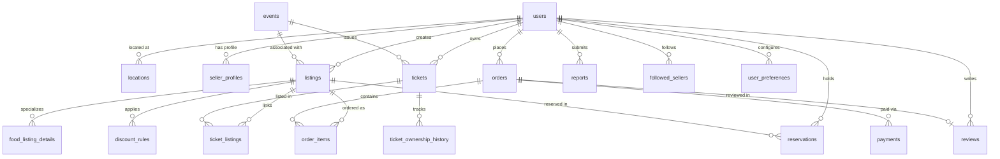

# LastCall — Dynamic Surplus Food Rescue & Verified Ticket Marketplace

> **A sustainable commerce platform designed to eliminate urban food waste and combat event ticket fraud through time-decay pricing, atomic inventory holds, and verified chain-of-custody transfers.**

[](https://web-production-e47b9.up.railway.app)
[](https://github.com/aunabil-abtahi/lastcall/actions)

**Live Production URL:** [https://web-production-e47b9.up.railway.app](https://web-production-e47b9.up.railway.app)

---

## 🌟 Executive Summary & Problem Statement

Modern cities face two distinct yet pressing retail inefficiencies:

1. **Perishable Food Waste**: Restaurants, bakeries, and grocery stores discard tons of fresh, edible surplus food daily simply because items approach end-of-day shelf life.
2. **Event Ticket Fraud & Scalping**: Secondary event ticket markets are plagued by counterfeit tickets, invalid PDF barcodes, price gouging, and predatory scalpers.

**LastCall** solves both problems on a single unified platform:

- **Dynamic Surplus Food Rescue**: Allows food businesses to publish short-window surplus meals with automatic, time-decay step-down discounts (e.g., 10% off at 2 hours, 25% off at 1 hour, 40% off at 30 minutes before cutoff).
- **Fraud-Free Ticket Resale**: Verifies event organizers and secondary ticket sellers. Secondary tickets are vetted by platform administrators, checked against official event rosters, and transferred atomically with a non-fungible ownership history ledger to eliminate double-selling.
- **5-Minute Atomic Holds**: Protects buyers from race conditions during checkout using concurrency-safe database reservations.

---

## 🛠 Technology Stack

| Layer | Technology | Description |
| :--- | :--- | :--- |
| **Backend** | PHP 8.2+ | Native vanilla PHP architecture with strictly prepared PDO database abstraction |
| **Database** | MySQL / MariaDB 10.4+ | 18 InnoDB tables, strict foreign keys, cascade rules, and 2 real-time analytical views |
| **Frontend** | HTML5, Modern CSS3 | Custom design system with glassmorphism, responsive grids, and dark/vibrant aesthetics |
| **Interactivity** | Vanilla JavaScript (ES6+) | Real-time countdown clocks, dynamic discount tickers, modal dialogs, and instant toast alerts |
| **Payments** | SSLCOMMERZ Sandbox & Mock | Dual-mode checkout: Instant Mock testing and full cryptographic SSLCOMMERZ payment gateway integration |
| **Server** | Apache (XAMPP) | Local development stack running on `http://localhost/lastcall/` |

---

## 🔐 Security Architecture

LastCall implements multi-layered enterprise application security:

1. **CSRF (Cross-Site Request Forgery) Protection**:
   - Centralized security engine (`includes/csrf.php`) integrated into platform authentication.
   - Generates cryptographically secure 32-byte session tokens.
   - Strictly enforced on **100% of POST endpoints** via `require_csrf()`.
   - Form-level injection (`<?= csrf_field() ?>`) across all authentication, checkout, administrative, and seller management forms.
   - Timing-safe validation using PHP's native `hash_equals()`.
   - Automatic HTTP 403 Forbidden with security alerts upon token tampering or absence.

2. **SQL Injection Prevention**:
   - Zero raw string concatenation in SQL queries.
   - 100% prepared statements via PHP Data Objects (`PDO::prepare()` & `execute()`) with bound parameters.

3. **Authentication & Session Security**:
   - Cryptographic password hashing via `password_hash()` utilizing `PASSWORD_BCRYPT` (work factor 10).
   - Session fixation mitigation with secure cookie configuration and strict lifecycle handling.
   - Multi-role authorization gates (`requireRole()`, `requireLogin()`) preventing horizontal and vertical privilege escalation.

4. **Server-Side Input Sanitization & Validation**:
   - Cross-Site Scripting (XSS) mitigation via strict `htmlspecialchars(..., ENT_QUOTES, 'UTF-8')` escaping.
   - Strict Bangladeshi phone number validation (`/^01[3-9]\d{8}$/`).
   - Email format sanitization via `filter_var(..., FILTER_VALIDATE_EMAIL)`.
   - Positive price bounds, inventory constraints, and deadline sanity checks.
   - Account status checking (`active`, `suspended`, `blocked`) on every authenticated request.

---

## 👥 Demo Accounts Matrix

The system includes pre-seeded accounts configured for exploring the platform and evaluating core features:

| Role | Email Address | Name / Business Name | Primary Capabilities |
| :--- | :--- | :--- | :--- |
| 🛡 **Admin** | `admin@lastcall.test` | LastCall Admin | Seller approvals, ticket vetting, user bans, dispute resolution, demo seeder |
| 🍱 **Food Seller** | `food@lastcall.test` | Dhaka Food House | Create surplus meal listings, set time-decay discount tiers, manage sales |
| 🎟 **Organizer** | `events@lastcall.test` | Dhaka Live Events | Publish official concerts/events, issue verified tickets (instant approval) |
| 🎫 **Ticket Seller** | `ticket@lastcall.test` | Karim Ticket Resale | Resell personal tickets (requires admin verification before listing goes live) |
| 🛒 **Buyer** | `buyer@lastcall.test` | Rahim Ahmed | Browse marketplace, reserve items (5-min hold), checkout, write reviews |

> [!NOTE]
> Demo accounts are pre-seeded with a default password defined in `database/seed.sql`. Always update and secure credentials before deploying to a production environment.

---

## ⚡ Quick Start & Installation Guide

### 1. Prerequisites

- Install **XAMPP** (or any Apache + MySQL stack with PHP 8.2+).
- Ensure Apache and MySQL services are running in your XAMPP Control Panel.

### 2. Setup Project Files

Clone or copy the repository into your web server document root:

```bash
# Example paths:
# Windows (XAMPP): C:/xampp/htdocs/lastcall
# Linux (Apache):  /var/www/html/lastcall
git clone https://github.com/aunabil-abtahi/lastcall.git
```

### 3. Database Initialization

1. Open **phpMyAdmin** (`http://localhost/phpmyadmin/`) or MySQL CLI.
2. Create the database:

   ```sql
   CREATE DATABASE lastcall CHARACTER SET utf8mb4 COLLATE utf8mb4_unicode_ci;
   ```

3. Import the database schema and views:

   ```bash
   mysql -u root lastcall < database/schema.sql
   ```

4. Import the initial seed dataset:

   ```bash
   mysql -u root lastcall < database/seed.sql
   ```

### 4. Configuration

1. In the project root, copy `.env.example` to `.env`:

   ```bash
   cp .env.example .env
   ```

2. Verify database connection credentials in `.env` (default XAMPP setup):

   ```env
   DB_HOST=127.0.0.1
   DB_NAME=lastcall
   DB_USER=root
   DB_PASS=
   APP_URL=http://localhost/lastcall
   SSLCOMMERZ_MODE=sandbox
   ```

### 5. Launch the Platform

Navigate to **`http://localhost/lastcall/`** in any modern web browser.

---

## 🚀 Interactive Demo & Feature Walkthrough

LastCall includes a built-in **Demo Floating Toolbar** (visible at the bottom of the screen) specifically designed for live product tours and evaluating core features:

```text
[ Quick Switch: (Buyer) (Food Seller) (Organizer) (Ticket Seller) (Admin) ] [ ⚡ Seed Demo Data ] [ 🗑 Clear Demo ]
```

### Demonstration Steps

1. **One-Click Seeding**:
   - Click the **"⚡ Seed Demo Data"** button in the floating toolbar.
   - The platform instantly generates realistic Dhaka surplus meals (Biryani, Artisan Pastries, Sushi Platters) and concert tickets (Dhaka Music Night, Rock Fest) with dynamic discount rules and real countdown clocks.

2. **Surplus Food Rescue with Dynamic Pricing**:
   - Switch to **Buyer** mode using the toolbar.
   - Inspect a surplus food listing on the home page. Observe the **Live Countdown Timer** and dynamic discount badge.
   - Click **Reserve** — an atomic 5-minute reservation hold is placed, decrementing available stock and protecting the price.
   - Complete payment via **Mock Checkout** (or SSLCOMMERZ Sandbox). Notice the order status updates to `completed`.

3. **Anti-Scalping Ticket Verification & Transfer**:
   - Switch to **Ticket Seller** (`Karim Hasan`).
   - Submit an individual ticket listing for an upcoming event.
   - Note the status is set to `pending` verification (hidden from public marketplace).
   - Switch to **Admin** via the toolbar -> Navigate to **Ticket Verification** -> Click **Verify Ticket**.
   - Switch back to **Buyer** — the ticket is now live! Reserve and purchase it.
   - View **My Orders** / **Ticket Wallet** to verify the ticket barcode and review the **Ownership History Ledger** showing the cryptographically verified transfer of custody from seller to buyer.

4. **Seller Feedback & Reviews Ecosystem**:
   - As the buyer, go to **My Orders** -> Click **Leave a Review**.
   - Submit a 5-star rating with comments.
   - Switch to **Food Seller** -> Open **Seller Dashboard**.
   - View real-time KPIs computed dynamically via MySQL view `view_seller_analytics` (Total Sales, Revenue BDT, Average Star Rating, and Customer Reviews Feed).

5. **Personalization & Social Following**:
   - In Buyer mode, follow your favorite seller.
   - Go to **Recommended for You** — listings are prioritized based on your saved food/ticket preferences and followed vendors.
   - Visit the **Community Leaderboard** to see top-rated sustainable food heroes and verified event organizers.

6. **Administrative Governance & Clean Reset**:
   - Switch to **Admin** to inspect the **Admin Dashboard**, **User Management** (ban/suspend users), and **Dispute Reports**.
   - Click **"🗑 Clear Demo Data"** to cleanly wipe generated demo records without touching core configuration.

---

## 🗄 Database Schema & Architecture

The database adheres to 3rd Normal Form (3NF) across 18 InnoDB relational tables:



### Analytical Views

- **`view_seller_analytics`**: Aggregates total listings, active inventory, lifetime gross revenue, items sold, and rolling average star ratings per vendor without manual caching.
- **`view_listing_reviews`**: Combines reviews with verified order items, buyer names, and business profiles for fast marketplace rendering.

---

## 💳 SSLCOMMERZ Sandbox Gateway Integration

LastCall features integration with Bangladesh's premier payment gateway:

- **Sandbox Credentials**: Configured via `.env` (`SSLCOMMERZ_STORE_ID`, `SSLCOMMERZ_STORE_PASSWORD`).
- **Server-to-Server Validation**: Verification endpoint validates transaction ID, currency (`BDT`), and reserved amount directly with SSLCOMMERZ servers before order fulfillment.
- **IPN (Instant Payment Notification)**: Handled via `payments/ipn.php` with idempotent transaction state guards.
- **Reservation Rollback**: Abandoned or failed payments trigger immediate release of inventory reservations.

---

## 🧪 Automated Testing & Verification

The project includes an automated PHP CLI test suite covering core functionality:

```bash
# Execute Phase 6 security, CSRF defense & input validation test suite
php tests/test_phase6_features.php

# Execute Phase 5 admin platform management test suite
php tests/test_phase5_features.php

# Execute buyer features & digital ticket wallet test suite
php tests/test_buyer_features.php

# Execute subpage rendering and template linting suite
php tests/test_subpages_render.php
```

### Verified Test Matrix

- ✅ **CSRF Protection**: HTTP 403 rejection on missing/forged tokens, successful acceptance with valid tokens.
- ✅ **Input Validation**: Rejection of malformed phone numbers, invalid emails, negative prices, and empty feedback.
- ✅ **Atomic Reservations**: Expiry triggers, concurrency locks, and duplicate prevention.
- ✅ **Chain of Custody**: Immutable ticket transfer history logs and single-owner verification.
- ✅ **Role-Based Routing**: Strict boundary enforcement between buyers, sellers, and administrators.

---

## 📄 License & Project Attribution

Developed as a full-featured software engineering project demonstrating modern web standards, sustainable e-commerce design, and robust platform security.

*Built with ❤️ for a cleaner, greener, and fraud-free digital marketplace.*
